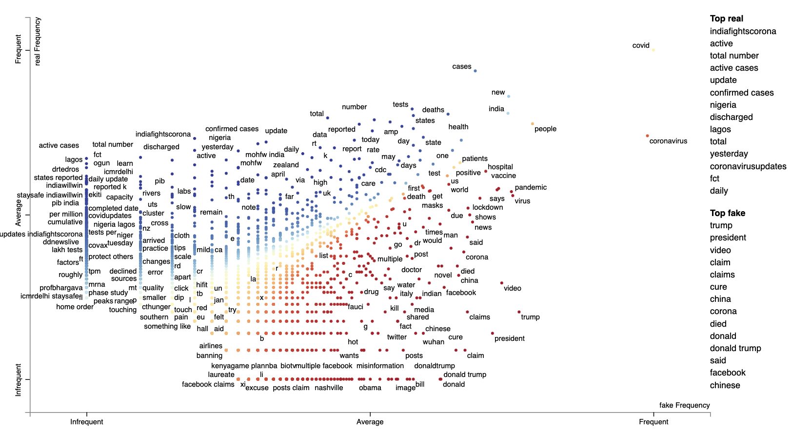
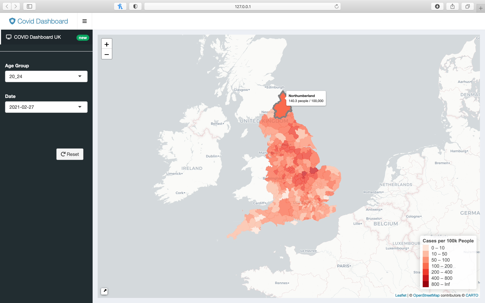
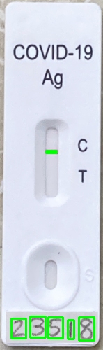

# <a id="global-monkeypox-outbreak">[2022 Monkeypox Outbreak: Global Trends](https://worldhealthorg.shinyapps.io/mpx_global/)</a>

I contributed to the WHO's [2022 Monkeypox Outbreak: Global Trends](https://worldhealthorg.shinyapps.io/mpx_global/) report announced [here](https://reliefweb.int/report/world/who-director-generals-opening-remarks-second-meeting-ihr-emergency-committee-regarding-multi-country-outbreak-monkeypox-21-july-2022).

<blockquote class="twitter-tweet">

The World Health Organization <a href="https://twitter.com/WHO?ref_src=twsrc%5Etfw">@WHO</a> has launched a live data dashboard for the multi-country monkeypox outbreak.  Access via: <a href="https://t.co/W6xAUxRrNH">https://t.co/W6xAUxRrNH</a>   More details on the epidemiological data can be found in the online epidemiological report here: <a href="https://t.co/59a07fLQ3T">https://t.co/59a07fLQ3T</a> <a href="https://t.co/7Zb4foO7O9">pic.twitter.com/7Zb4foO7O9</a>
&mdash; Chikwe Ihekweazu (@Chikwe_I) <a href="https://twitter.com/Chikwe_I/status/1551521737090760704?ref_src=twsrc%5Etfw">July 25, 2022</a></blockquote> 

***

# <a id="detecting-covid-fake-news">[Detecting COVID-related Fake News with NLP](https://github.com/smkerr/COVID-fake-news-detection)</a>
Alarmed by the amount of COVID-related fake news circulating through social media platforms, my classmates [Hannah Schweren](https://github.com/hannahmagda), [Marco Schildt](https://github.com/m-schildt), and I set out to construct our own fake news detection algorithm. We used Patwa et al.'s [Covid-19 Fake News dataset](https://paperswithcode.com/dataset/covid-19-fake-news-dataset) comprising 10,700 Covid-related social media posts labeled either “real” or “fake” to develop a competitive prediction model. We also examined the extent to which our fake news detection algorithm degraded over time due to the ever-evolving nature of fake news.

Here's the [blog post](assets/html/ML-blog-post.html) we prepared for the Hertie Data Science Lab detailing our project.

:octocat: [GitHub](https://github.com/smkerr/COVID-fake-news-detection)

{: .center-image }

***

# <a id="uk-covid-dashboard">[UK COVID Dashboard Disaggregated by Age Group](https://github.com/intro-to-data-science-21/data-project-covid_dashboard_uk)</a>
Together with fellow master's students [Kai Foerster](https://github.com/kaifoerster) and [Dominik Cramer](https://github.com/DominikCramer), I created a dashboard to track COVID case rates in England with the option to disaggregate by age group. We extracted our data using the API for [the official UK government website for data and insights on COVID](https://coronavirus.data.gov.uk). To build our map, we downloaded boundary data for all 309 local authority districts from [the Office of National Statistics' web portal](https://geoportal.statistics.gov.uk/datasets/local-authority-districts-december-2019-boundaries-uk-bfc-1/explore). As seen below, the user can observe COVID case rates for selected age groups during different time periods.

:octocat: [GitHub](https://github.com/intro-to-data-science-21/data-project-covid_dashboard_uk)

***

# <a id="validating-covid-self-tests">[Validating COVID Self Tests with Image Recognition](https://github.com/smkerr/COVID-test-validation)</a>
With the understanding that COVID rapid tests will continue to play a key role in the post-pandemic world, I once again found myself working alongside [Kai Foerster](https://github.com/kaifoerster) and [Dominik Cramer](https://github.com/DominikCramer) to develop a program capable of validating COVID self tests using image recognition. We used data from the [MNIST database of handwritten digits](http://yann.lecun.com/exdb/mnist/), a collection of 70,000 examples, to train our Machine Learning algorithm to recognize handwritten serial numbers and COVID test results.

:octocat: [GitHub](https://github.com/smkerr/COVID-test-validation)

{: .center-image }

[Go to the Home Page]({{ '/' | absolute_url }})
