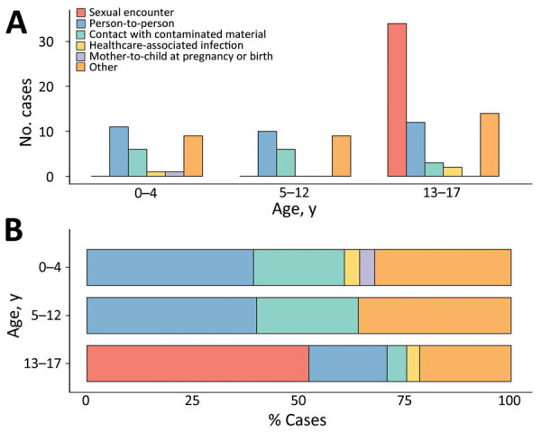

# <a id="ragc-chatbot">[Tutorial: Retrieval Augmented Generation with Citation (RAG+C)](https://github.com/smkerr/tutorial-rag-c)</a>

As a final project for my [Deep Learning (GRAD-E1394)](https://www.hertie-school.org/en/study/course-catalogue/course/course/deep-learning) course, I partnered with [Kai Foerster](https://github.com/kaifoerster) and [Amin Oueslati](https://github.com/amin-oueslati) to create a tutorial on how to implement a Retrieval Augmented Generation with Citation (RAG+C) chatbot to address the challenge of knowledge management in government. In essence, RAG+C provides Large Language Models (LLMs) with additional contextual information sourced from an external database, which significantly improves response accuracy and avoids hallucinations, particularly on highly domain-specific topics. 

As a demonstration, we develop a RAG+C chatbot to answer questions about the U.S. Federal Acquisition Regulation (FAR), the rule book for public procurement in the United States. We show you how to load and process FAR documents, store them in a database, and build your very own RAG+C pipeline. Lastly, this tutorial shows how to deploy models as a Conversation User Interface (CUI) (think chatbot) on a web server. You can access our "FAR-Chat" hosted on Hugging Face Spaces [here](https://huggingface.co/spaces/smkerr/rag-chat).

:octocat: [See the code](https://github.com/smkerr/tutorial-rag-c)

{: .center-image}

***

# <a id="eu-procurement">[EU Procurement Networks](https://github.com/smkerr/EU-procurement)</a>

As part of the [Applied Network Analysis (GRAD-E1426)](https://www.hertie-school.org/en/study/course-catalogue/course/course/applied-network-analysis) at the Hertie School, I worked with fellow students [Kai Foerster](https://github.com/kaifoerster), [Danial Riaz](https://github.com/danialriaz/), and [Lukas Lehmann](https://github.com/lukaslehmann-R) to examine the network dynamics within EU public procurement markets. Our dataset consisted of 234 networks across 26 European countries from 2008 to 2016, focusing on a subset of countries and years. The networks comprised issuers or "buyers" (such as public hospitals and ministries) and winners or "suppliers" of public contracts (mainly private-sector firms). We explored network characteristics related to different levels of perceived government corruption. 

To give a specific example, the network graph below depicts Slovakia's public procurement market in 2014. It features issuers and winners as gray and white nodes, respectively. The connections between these nodes are colored based on the single bidding rate - a metric linked to government corruption. Red links represent a higher-than-average single bidding rate, suggesting potential corruption risks, while blue links indicate a rate below average. Notably, several clusters of red links shown in the graph signal heightened corruption risk in those contracts.

:octocat: [See the code](https://github.com/smkerr/EU-procurement)

{: .center-image}

***

# <a id="news-israel-gaza">[News coverage of 2023 Israel-Hamas War)](https://github.com/smkerr/news-israel-gaza)</a>

Following Hamas's surprise October 7 attack on Israel and the subsequent Israeli military campaign in the Gaza Strip, the media's response quickly became polarized. I collaborated with my fellow classmates [Kai Foerster](https://github.com/kaifoerster), [Danial Riaz](https://github.com/danialriaz), and [Max Eckert](https://github.com/m-b-e) to investigate (1) how news coverage of these events evolved over time and (2) the extent to which new coverage varied by news outlet. To answer these questions, we sourced 4,000+ articles from various news outlets including the New York Times, Al Jazeera, and Die Welt which were published in the weeks immediately preceding and following the October 7 attack. We employ topic modeling to identify topics associated with Israel, Hamas, and Palestine as well as sentiment analysis to measure the extent to which the emotional valence of news coverage varied by group.

:octocat: [See the code](https://github.com/smkerr/news-israel-gaza)

{: .center-image}

***

# <a id="global-monkeypox-outbreak">[2022-23 Mpox Outbreak: Global Trends Report](https://worldhealthorg.shinyapps.io/mpx_global/)</a>

I helped to build and maintain WHO's [2022-23 Mpox (Monkeypox) Outbreak: Global Trends Report](https://worldhealthorg.shinyapps.io/mpx_global/).

<blockquote class="twitter-tweet">
With over 86,000 total cases &amp; 96 related deaths, <a href="https://twitter.com/hashtag/mpox?src=hash&amp;ref_src=twsrc%5Etfw">#mpox</a> outbreak has slowed down but is still ongoing in several countries.  Maintained surveillance &amp; enhanced access to diagnostics, vaccines and treatments are key to stop the disease transmission globally <a href="https://t.co/mLHsVoWKBY">https://t.co/mLHsVoWKBY</a> <a href="https://t.co/PcLFQjjrz7">pic.twitter.com/PcLFQjjrz7</a>
&mdash; World Health Organization (WHO) (@WHO) <a href="https://twitter.com/WHO/status/1628121766097989632?ref_src=twsrc%5Etfw">February 21, 2023</a></blockquote> 

***

# <a id="mpox-lancet-paper">[Description of the First Global Outbreak of Mpox: An Analysis of Global Surveillance Data](https://doi.org/10.1016/S2214-109X(23)00198-5)</a>

Building on my mpox data analytics experience, I collaborated with WHO on a [*Lancet Global Health* publication](https://doi.org/10.1016/S2214-109X(23)00198-5) describing the epidemiological characteristics, demographic trends, and risk factors surrounding the 2022-23 mpox outbreak. Leveraging the most extensive dataset of mpox cases available, the paper provides invaluable data-driven insights into the dynamics of the outbreak.

<blockquote class="twitter-tweet">
Epidemiological and clinical characteristics, as well as risk factors for hospitalization, of <a href="https://twitter.com/hashtag/mpox?src=hash&amp;ref_src=twsrc%5Etfw">#mpox</a> cases during the 2022-23 multi-country outbreak, from the <a href="https://twitter.com/WHO?ref_src=twsrc%5Etfw">@WHO</a> global surveillance system, published in <a href="https://twitter.com/LancetGH?ref_src=twsrc%5Etfw">@LancetGH</a>. 👏 &amp; 🙏to countries for sharing their data. <a href="https://t.co/OcBEA00K00">pic.twitter.com/OcBEA00K00</a>
&mdash; Ana Hoxha (@AnaHoxhaEpi) <a href="https://twitter.com/AnaHoxhaEpi/status/1671768740323524609?ref_src=twsrc%5Etfw">June 22, 2023</a></blockquote> <script async src="https://platform.twitter.com/widgets.js" charset="utf-8"></script

[Mpox in Children and Adolescents during Multicountry Outbreak, 2022–2023](https://doi.org/10.3201/eid2910.230516)</a>

Continuing my work with WHO, I served as co-first author on a [publication in the U.S. CDC's [*Emerging Infectious Diseases*] Journal](https://doi.org/10.3201/eid2910.230516) in which our team examined mpox cases among children and adolescents during the 2022-23 mpox outbreak. While the outbreak predominantly affected adult men, 1.3% of reported cases were in children and adolescents <18 years of age. Analysis of global surveillance data showed one hospital intensive care unit admission and zero deaths in that age group. Transmission routes and clinical manifestations varied across age subgroups.

{: .center-image }

***

# <a id="plotly-workshop">[Tutorial: Interactive Graphics with `plotly`](https://github.com/smkerr/plotly-workshop)</a>

As part of the [**Introduction to Data Science (I2DS) Tools for Data Science Workshop**](https://intro-to-data-science-21-workshop.github.io/) hosted by the Hertie School on 4 November 2021, I partnered with [Julian Kath](https://github.com/juka19/) to present on **Interactive Graphics with `plotly`*. High-quality data visualization is essential for effective communication of findings. `plotly` offers a straightforward way to build captivating graphics that will impress your audience. The goals of this tutorial are to:

1. Equip participants with conceptual knowledge about the `plotly` package and data visualization workflow
2. Demonstrate key capabilities of the package
3. Provide participants with practice material and further resources

While the interactive part of the session was held live at the Hertie School, the online portion can be viewed [here](https://vimeo.com/641454552/3724dfb535).

:octocat: [See the code](https://github.com/smkerr/plotly-workshop)

{: .center-image }

***

# <a id="detecting-covid-fake-news">[Detecting COVID-related Fake News with NLP](https://github.com/smkerr/COVID-fake-news-detection)</a>

Alarmed by the amount of COVID-related fake news circulating through social media platforms, my classmates [Hannah Schweren](https://github.com/hannahmagda), [Marco Schildt](https://github.com/m-schildt), and I set out to construct our own fake news detection algorithm. We used Patwa et al.'s [Covid-19 Fake News dataset](https://paperswithcode.com/dataset/covid-19-fake-news-dataset) comprising 10,700 Covid-related social media posts labeled either “real” or “fake” to develop a competitive prediction model. We also examined the extent to which our fake news detection algorithm degraded over time due to the ever-evolving nature of fake news.

Here's the [blog post](assets/html/ML-blog-post.html) we prepared for the Hertie Data Science Lab detailing our project.

:octocat: [See the code](https://github.com/smkerr/COVID-fake-news-detection)

{: .center-image }

***

# <a id="uk-covid-dashboard">[UK COVID Dashboard Disaggregated by Age](https://github.com/intro-to-data-science-21/data-project-covid_dashboard_uk)</a>

Together with fellow master's students [Kai Foerster](https://github.com/kaifoerster) and [Dominik Cramer](https://github.com/DominikCramer), I created a dashboard to track COVID case rates in England with the option to disaggregate by age group. We extracted our data using the API for [the official UK government website for data and insights on COVID](https://coronavirus.data.gov.uk). To build our map, we downloaded boundary data for all 309 local authority districts from [the Office of National Statistics' web portal](https://geoportal.statistics.gov.uk/datasets/local-authority-districts-december-2019-boundaries-uk-bfc-1/explore). As seen below, the user can observe COVID case rates for selected age groups during different time periods.

:octocat: [See the code](https://github.com/intro-to-data-science-21/data-project-covid_dashboard_uk)

***

# <a id="validating-covid-self-tests">[Validating COVID Self-Tests with Image Recognition](https://github.com/smkerr/COVID-test-validation)</a>

With the understanding that COVID rapid tests will continue to play a key role in the post-pandemic world, I once again found myself working alongside [Kai Foerster](https://github.com/kaifoerster) and [Dominik Cramer](https://github.com/DominikCramer) to develop a program capable of validating COVID self tests using image recognition. We used data from the [MNIST database of handwritten digits](http://yann.lecun.com/exdb/mnist/), a collection of 70,000 examples, to train our Machine Learning algorithm to recognize handwritten serial numbers and COVID test results.

[See the code](https://github.com/smkerr/COVID-test-validation) :octocat: 

{: .center-image }

[Go to the Home Page]({{ '/' | absolute_url }})
